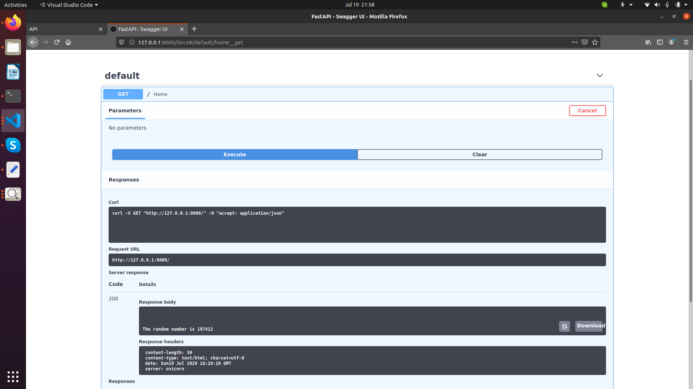

# TASK : To build a random generator API and add a rate limiting service on top of it


To approach the problem, I have used a Django web framework to manage the users as well as design the frontend of the API.

The random generator (API A) was designed using the FastAPI framework and integrated into the Django Web framework.
The two applications were run on different lcoalhost servers where the Django API would call results from API A and display it on the interface.
 
### Base Requirements:
Base language to run project:
1. python 3.6+
 
### Requirements
A basic understanding of the below tools will be essential to understand this example:
1. fastapi
2. uvicorn
3. jinja2
4. django
5. requests
6. django-ratelimit

To install requirements,

```
pip3 install -r requirements.txt
```

## Procedure
Follow the below steps:
### 1. To run django server on localhost, go to task folder using :

```
cd django/task/
python3 manage.py makemigrations
python3 manage.py migrate
python3 manage.py runserver 7000
```


### 2. To run fastapi server:


### (Necessary)
```
cd fastapi/
uvicorn main:app --reload --port 8000 
```


### 3. The signup and login page was made on the Django API using the default django libraries aka Authentication and Signup forms.


### 4. The random number is called from the fastapi interface onto the django webpage.


### 5. After refreshing the page (GET Request) 5 times, the rate limiting functionality of the Django interface and returns a "403 Forbidden" error message. This functionality happens whenever a user tries to access a random number more than 5 times, and locks the user out for a minute before it resets.  


### 6. The following snippet shows the fastapi interface getting call requests from our django interface to call the random number onto the webpage


### 7. When accessing the /docs of the fastapi interface, we can try out the random function and execute it to receive and random number.





